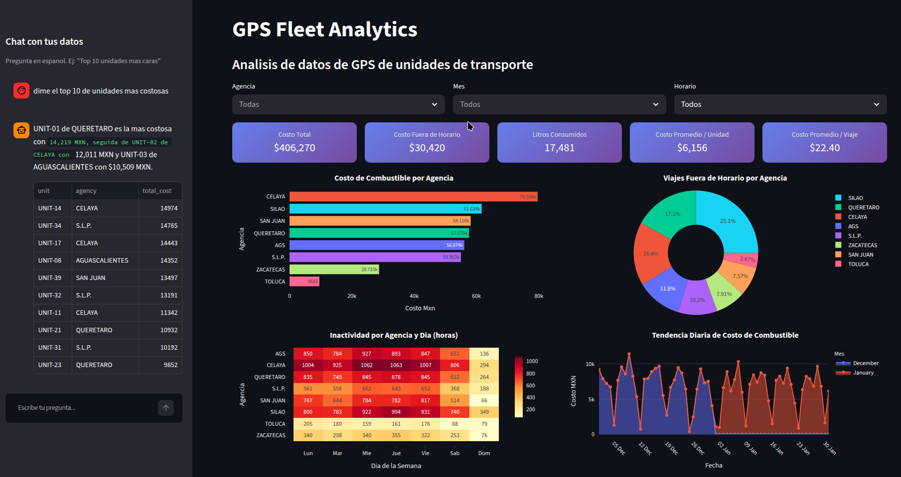

# GPS Fleet Analytics

Python ETL pipeline that automates raw GPS Excel processing into a queryable SQLite database and a Streamlit dashboard — with AI chat to explore your data in plain Spanish.



## Problem

A fleet team tracked 66 vehicles across 8 cities with GPS devices exporting raw Excel files. Every month, an analyst manually opened 15 files, consolidated sheets, calculated fuel costs, and flagged anomalies. One command now replaces that entire workflow.

## What it does

- **Automated ETL:** Reads 15 multi-sheet Excel files, extracts 18,133 trips, calculates fuel cost, applies traffic-light rules, exports formatted reports, and loads everything into SQLite
- **AI Chat:** Ask questions in Spanish ("Top 10 unidades mas caras") — the AI translates to SQL, queries the database, and responds with insights
- **Interactive Dashboard:** 5 KPIs, 4 charts (bar, donut, heatmap, trend), 3 real-time filters (agency, month, schedule)


## Tech stack

Python 3.12 | pandas | openpyxl | SQLite | Streamlit | Plotly | Groq

## Quick start

```bash
git clone https://github.com/your-user/gps-fleet-analytics.git
cd gps-fleet-analytics
bash setup.sh           # Creates venv, installs deps, runs ETL
source venv/bin/activate
streamlit run app.py    # Dashboard + AI chat
```

## Data

| Metric | Value |
| ------ | ----- |
| Raw files | 15 Excel (Dec 2021 + Jan 2022) |
| Cities | 8 (Aguascalientes, Celaya, Queretaro, San Juan, Silao, SLP, Toluca, Zacatecas) |
| Trips processed | 18,133 |
| Unique units | 66 |
| Fuel efficiency | 17.23 km/L |
| Gas price | $23.24 MXN/L |

## License

Portfolio project for demonstration purposes.

